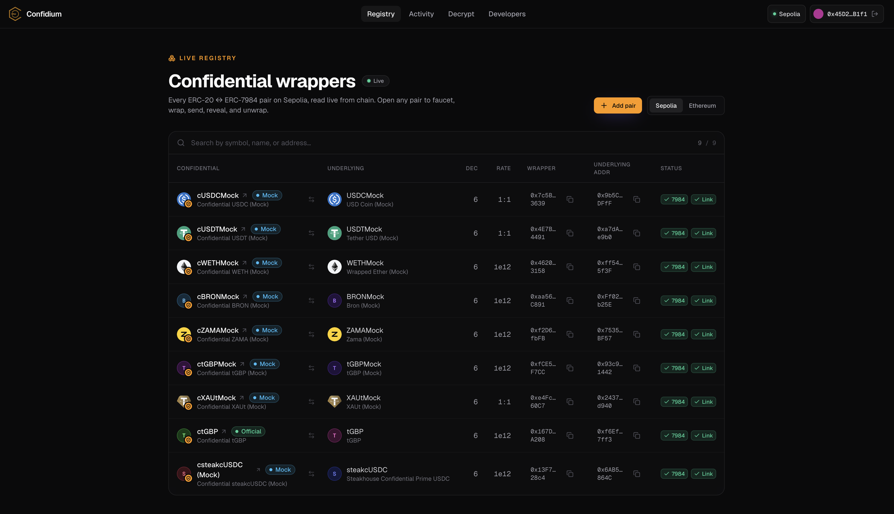

<div align="center">


# Confidium

**The home of confidential tokens.**

A production-ready dApp for the [Zama Confidential Wrappers Registry](https://docs.zama.ai/protocol) — browse every ERC‑20 ↔ ERC‑7984 pair, wrap, unwrap, and decrypt **any** confidential token, on Sepolia (full) and Ethereum (read‑only).

**Live:** https://confidium.vercel.app · **Demo:** _add your video link_ · **X:** https://x.com/isNuelo/status/2074597679611482199

</div>

<p align="center">
  
</p>

---

## What it is

The Zama Wrappers Registry is an on‑chain directory that maps standard ERC‑20 tokens to their confidential ERC‑7984 counterparts. It's powerful but raw — just contract calls. **Confidium turns it into a usable product**: a fast explorer over the live registry, plus the full confidential‑token lifecycle (faucet → wrap → reveal → send → unwrap), a universal decryptor for *any* ERC‑7984 token, a hybrid registry that anyone can extend, and a reusable SDK + token list for other developers.

## Features

| Feature | Notes |
|---|---|
| Live registry explorer | Every pair read on‑chain via multicall, enriched with metadata, searchable, badged. Sepolia + Ethereum. |
| Faucet | Mint official Sepolia `cTokenMock` underlyings to test with. |
| Wrap | ERC‑20 → confidential ERC‑7984 (approve + wrap). |
| Unwrap | Full async protocol: burn → public‑decrypt → finalize, driven entirely by the dApp. |
| Confidential send | Transfer an ERC‑7984 to anyone; the amount stays encrypted end‑to‑end (one tx, no decrypt). |
| Reveal balance | EIP‑712 user‑decrypt of your confidential balance, with session caching. |
| Decrypt any ERC‑7984 | Paste any confidential token address — auto‑validates via ERC‑165 and decrypts. Not limited to the registry. |
| Activity feed | Per‑wallet history of wraps, unwraps, sends and receives, reconstructed from on‑chain events; amounts stay encrypted. |
| Pending‑unwrap recovery | Detects unwraps that were burned but never finalized (e.g. a closed tab) and lets you finalize them. Funds never get stuck. |
| Hybrid registry + add‑a‑pair | On‑chain registry is the source of truth; add extra pairs via the in‑app form or committed config. See [below](#adding-a-pair). |
| Embeddable widget | Drop a wrap/unwrap box into any site with one `<iframe>`. See [Building on Confidium](#building-on-confidium). |
| Developer SDK + token list | [`@confidium/core`](https://www.npmjs.com/package/@confidium/core) on npm, and a [tokenlists.org](https://tokenlists.org)‑schema export at `/api/token-list`. |

## Supported networks

| Network | Chain ID | Mode | Registry |
|---|---|---|---|
| **Sepolia** | `11155111` | Full (read + write) | `0x2f0750Bbb0A246059d80e94c454586a7F27a128e` |
| **Ethereum** | `1` | Read‑only browse | `0xeb5015fF021DB115aCe010f23F55C2591059bBA0` |

All confidential operations (wrap/unwrap/decrypt) run on **Sepolia** via the Zama relayer. Mainnet is browse‑only.

---

## <a name="registry-sourcing"></a>How the registry is sourced (hybrid)

Confidium sources pairs from **two layers**, with the chain always winning:

1. **On‑chain registry (primary, source of truth).** On every load the app reads the official Zama registry contract for the active network — the full pair set, in one multicall — then enriches each pair with token metadata (`symbol`, `name`, `decimals`), an ERC‑165 `supportsInterface(0x4958f2a4)` check, the conversion rate, and a bidirectional‑link check. Cached server‑side for 60s.
2. **Local config (secondary, additive).** A committed array, `committedCustomPairs` in [`apps/web/src/lib/custom-pairs.ts`](apps/web/src/lib/custom-pairs.ts), lets you surface pairs that aren't (yet) in the on‑chain registry — useful for local development or a freshly deployed wrapper.

Every pair is **provenance‑labeled** so the source is never ambiguous:

- **Official** — present in the on‑chain registry, valid, implements ERC‑7984.
- **Mock** — official testnet mock token.
- **Custom** — added via config or the in‑app form (never shown as Official).
- **Unverified** — in the registry but failed a check (e.g. interface or bidirectional link).

This is the same enrichment pipeline (`enrichPairs` in `@confidium/core`) for both layers, so config and on‑chain pairs render identically.

## <a name="adding-a-pair"></a>Adding a pair

There are three ways a pair appears, in order of authority:

**1. It's added to the on‑chain registry → it just appears.** No code, no config. The explorer reads the registry live, so any newly‑registered pair shows up on the next load (within the 60s cache window), labeled **Official**.

**2. In‑app form (no code, per‑browser).** Go to **Add pair**, paste the underlying ERC‑20 address and the ERC‑7984 wrapper address. The app validates the wrapper really implements ERC‑7984 (rejects otherwise), then saves it to your browser. It appears under **Your custom pairs** with an **Open** link to a fully‑functional detail page, labeled **Custom**. Shareable as `/pair/<wrapper>?u=<underlying>`.

**3. Committed config (code, for everyone).** Add an entry to `committedCustomPairs`:

```ts
// apps/web/src/lib/custom-pairs.ts
export const committedCustomPairs: CustomPair[] = [
  {
    chainId: SEPOLIA_CHAIN_ID,
    underlying: "0xUnderlyingErc20…",
    wrapper: "0xConfidentialErc7984…",
    label: "My dev token",
  },
];
```

It's merged into the explorer server‑side and shown to all users, labeled **Custom** — the on‑chain registry stays the source of truth.

---

## Architecture

A pnpm + Turborepo monorepo:

```
confidium/
├── apps/web/            Next.js 15 (App Router) — the dApp
│   └── src/
│       ├── app/         explorer, pair detail, /decrypt, /add-pair, /embed, /developers, /api/*
│       ├── components/  table, pair actions (faucet/wrap/unwrap/send), decrypt, recovery, embed widget
│       └── lib/         viem clients, wagmi, fhEVM SDK, registry cache, custom pairs
├── packages/core/       @confidium/core — framework-agnostic registry SDK
│   └── src/             chains, ABIs, registry reads (enrichPairs), verification, types
└── scripts/             live Sepolia validators
```

**The reusable layer — `@confidium/core`:** addresses, ABIs, registry reads, the `enrichPairs` enrichment + verification pipeline, and the Sepolia SDK config — with zero React/Next dependencies. Any dApp can import it.

**Token list:** `GET /api/token-list` returns the verified wrappers in [tokenlists.org](https://tokenlists.org) schema so other apps can consume Confidium's canonical list with one URL.
- `?include=mock` — include testnet mocks (default: official only)
- `?chainId=11155111|1` — narrow to one network (default: both)

## <a name="building-on-confidium"></a>Building on Confidium (composable privacy)

**Embeddable wrap widget.** Any site can drop a confidential wrap/unwrap box in with a single `<iframe>` — the FHE plumbing is handled by Confidium. Visit **`/developers`** for a copy‑paste snippet (with your live domain pre‑filled) and a live preview.

```html
<iframe
  src="https://YOUR-CONFIDIUM-DOMAIN/embed?token=0x4E7B06D78965594eB5EF5414c357ca21E1554491"
  width="420" height="600" style="border:0;border-radius:16px">
</iframe>
```

`YOUR-CONFIDIUM-DOMAIN` is simply wherever you deployed the app (e.g. `confidium.vercel.app`) — one URL, the same for everyone; the iframe's visitor connects their own wallet. Query params on `/embed`:
- `token` — the ERC‑7984 wrapper address (required)
- `u` — its underlying ERC‑20 (only needed for custom pairs not in the registry)
- `action` — `wrap` (default) or `unwrap`

> Cross‑origin embedding requires the **host page** to send a `Cross-Origin-Embedder-Policy` header — the relayer SDK needs cross‑origin isolation. Same‑origin embeds (like the `/developers` preview) work out of the box.

## How confidential ops work (the tricky bits)

- **Cross‑origin isolation.** The Zama relayer SDK runs threaded WASM, which needs `Cross-Origin-Opener-Policy: same-origin` + `Cross-Origin-Embedder-Policy: credentialless`. Both are set in [`next.config.mjs`](apps/web/next.config.mjs) (`credentialless`, not `require-corp`, so the relayer/RPC still load).
- **Unwrap is two transactions, dApp‑driven.** `unwrap()` burns and emits `UnwrapRequested(receiver, requestId, amountHandle)`; the dApp then `publicDecrypt`s the handle and calls `finalizeUnwrap(requestId, cleartext, proof)` to release the ERC‑20.
- **Encrypted‑input txs can't be gas‑estimated**, so they're sent with explicit gas through the wallet provider; encryption and signing are split across user clicks to keep the wallet pop‑up in a trusted user gesture.
- **Recovery.** Because finalize is a separate tx, an interrupted unwrap leaves a pending request. Confidium finds these server‑side (public RPCs 403 browser `eth_getLogs`) and offers to finalize them.

---

## Local development

**Prerequisites:** Node ≥ 20, `pnpm` 10.x.

```bash
git clone https://github.com/NueloSE/confidium.git
cd confidium
pnpm install
cp apps/web/.env.example apps/web/.env.local   # optional but recommended
pnpm dev                                        # http://localhost:3000
```

Other scripts: `pnpm typecheck`, `pnpm lint`, `pnpm build`.

### Environment variables

All optional — the app falls back to public RPCs — but a dedicated RPC is strongly recommended for fast, reliable signing.

| Variable | Purpose |
|---|---|
| `NEXT_PUBLIC_SEPOLIA_RPC_URL` | Sepolia RPC (Alchemy/Infura). Falls back to public RPCs. |
| `NEXT_PUBLIC_MAINNET_RPC_URL` | Mainnet RPC for read‑only browse. |
| `NEXT_PUBLIC_WALLETCONNECT_PROJECT_ID` | Enables the WalletConnect connector (optional). |
| `NEXT_PUBLIC_RELAYER_URL` | Zama relayer (defaults to the Sepolia testnet relayer). |

## Deploy (Vercel)

The repo is a pnpm workspace; deploy the `apps/web` app:

1. Import the GitHub repo into Vercel.
2. **Root Directory:** `apps/web` (Vercel detects Next.js and installs from the workspace root).
3. **Environment variables:** set the ones above (at minimum a Sepolia + mainnet RPC).
4. Deploy. The COOP/COEP headers ship from `next.config.mjs` automatically.

> The relayer SDK needs cross‑origin isolation, which the configured headers provide — no extra Vercel config required.

## Roadmap

Confidium is complete for the bounty scope (Sepolia confidential ops + both‑network browse). The natural next steps toward full production:

- **Ethereum mainnet writes.** The app already reads the mainnet registry, and the relayer SDK ships a `MainnetConfig` (chainId `1`, `relayer.mainnet.zama.org`) — so wrap/unwrap/send/decrypt on Ethereum L1 is a single config switch away. It's intentionally **read‑only today**: mainnet means real funds, real gas, and no test faucet, so it warrants a dedicated "real‑funds" confirmation flow and on‑chain validation before shipping. The architecture is already multi‑network and ready for it.
- **Operator approvals** — surface ERC‑7984 `setOperator` so you can authorize another address to move your confidential tokens.
- **Published widget package** — ship the embeddable widget as an npm web component alongside the `<iframe>` embed.

## Tech stack

Next.js 15 · React 19 · TypeScript (strict) · Tailwind v4 · wagmi v3 · viem v2 · TanStack Query · `@zama-fhe/relayer-sdk` · Turborepo · pnpm.

## License

MIT.
